# MediaFlux 使用指南

> 更新日期：2026-08-15

## 目录

- [1. 首次使用顺序](#1-首次使用顺序)
- [2. 看板与搜索](#2-看板与搜索)
- [3. 统一整理规则](#3-统一整理规则)
- [4. 光鸭云盘](#4-光鸭云盘)
  - [4.1 登录与目录浏览](#41-登录与目录浏览)
  - [4.2 离线任务与分享转存](#42-离线任务与分享转存)
  - [4.3 自动整理与人工刮削](#43-自动整理与人工刮削)
- [5. 本地媒体整理](#5-本地媒体整理)
- [6. STRM 同步与播放](#6-strm-同步与播放)
- [7. RSS 与下载](#7-rss-与下载)
- [8. Telegram Bot](#8-telegram-bot)
- [9. 媒体探索与资源搜索](#9-媒体探索与资源搜索)
- [10. 日志、刮削实验室与纠偏](#10-日志刮削实验室与纠偏)
- [11. Media Agent](#11-media-agent)
- [12. 移动端](#12-移动端)

## 1. 首次使用顺序

1. 源码环境未初始化实例打开 `/setup` 创建管理员账号；Docker 预置初始化标记与管理员凭据后直接进入 `/login`。
2. 在“设置 → 控制台”配置 Jellyfin/Emby。
3. 在“设置 → 刮削识别”配置 TMDB API Key。
4. 按使用场景配置 qBittorrent、Telegram、光鸭和网络代理。
5. 在“整理规则”确认分类、扩展名、冲突和通知策略；命名采用系统固定契约。
6. 再配置光鸭整理、本地媒体来源和 STRM。

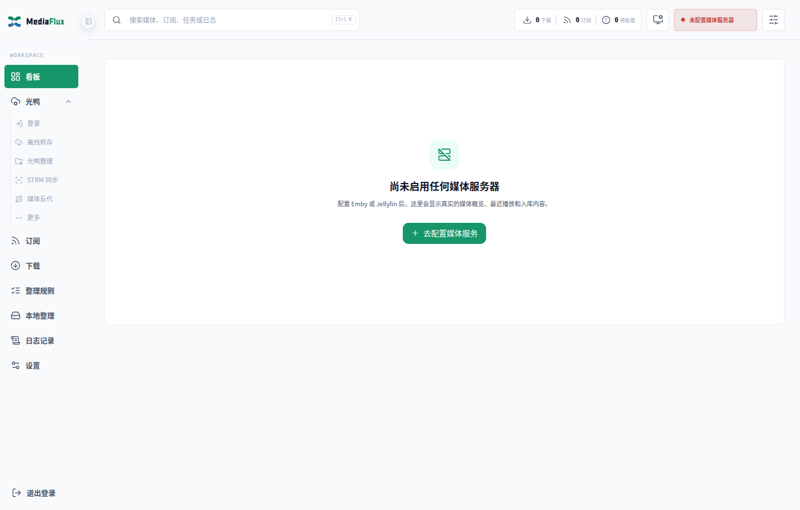

## 2. 看板与搜索

看板显示媒体服务器概览、下载/订阅/待处理状态、最近播放和最近入库。未配置媒体服务器时会显示明确的空状态。

顶部全局搜索可检索媒体、订阅、任务和日志。搜索页打开非本地媒体档案后，关闭会返回原搜索结果。

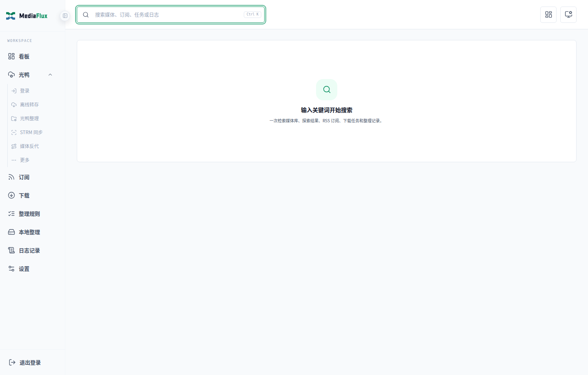

## 3. 统一整理规则

进入 `/organize-rules` 配置：

- 视频与伴随文件扩展名。
- 固定命名契约：电影独立 TMDB 目录，剧集使用 `Season N`（季号不补零） 与 `SxxExx`。
- 媒体规格自动尽力补全：本地直接 ffprobe，光鸭使用 signedURL/直链与成功缓存。
- TMDB 强制匹配规则、映射锁和 AI 回退。
- 电影/剧集/动漫分类目录。
- 冲突策略、多版本、回收站、空目录清理。
- Telegram 通知、STRM 联动和媒体库刷新。

规则同时供光鸭、本地、Web、Telegram 与定时任务使用。命名、媒体信息补全和媒体探测不再提供开关或模板；探测失败只回退到文件名规格，不阻断归档。

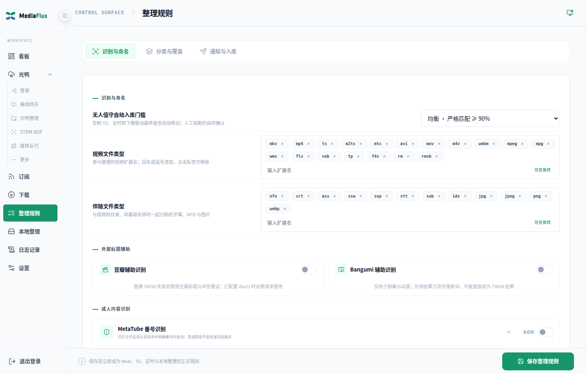

## 4. 光鸭云盘

### 4.1 登录与目录浏览

在“光鸭 → 登录”完成短信登录。目录浏览支持列表/网格、名称/时间/类型/大小排序、删除和媒体刮削操作。

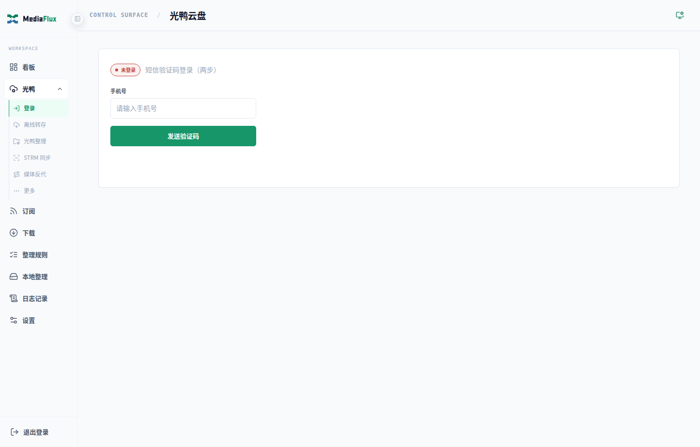

### 4.2 离线任务与分享转存

- “离线转存”提交磁力、ED2K、HTTP(S) 或种子。
- 允许扩展名为空时使用内置媒体默认值；解析器排除的文件不会触发伪完成通知。
- “分享转存”先解析文件树，再选择需要转存的文件和目标目录。

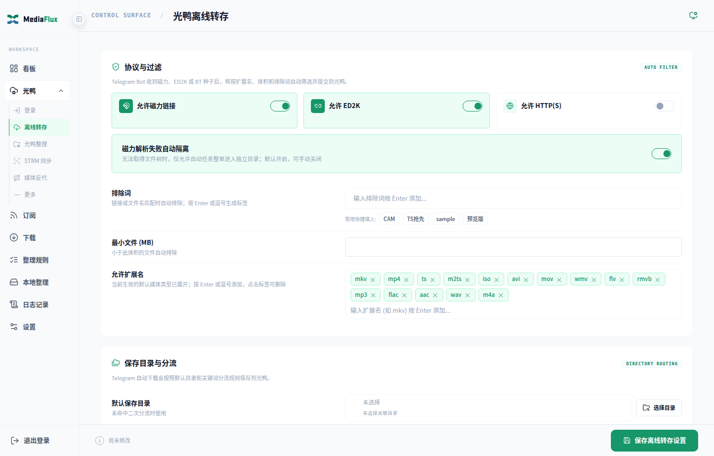
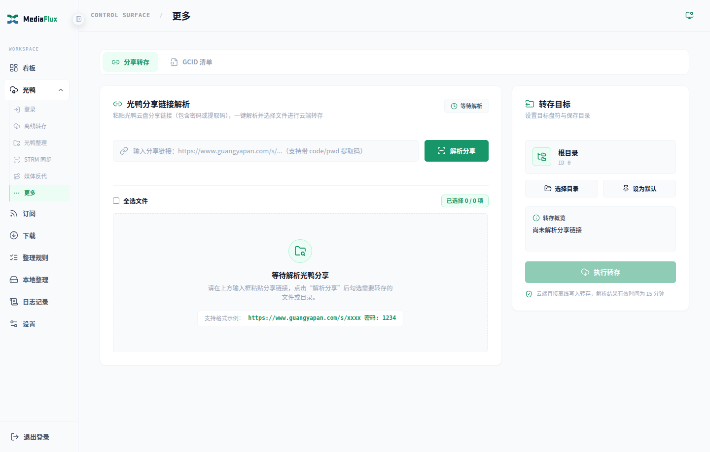

### 4.3 自动整理与人工刮削

“光鸭 → 网盘整理”配置多个来源目录和归档目标。执行前建议先生成预览。

目录浏览中的媒体目录或媒体文件可选择：

- 搜索并刮削：手工修改搜索词、类型、季号和 TMDB 候选。
- 自动匹配并刮削：复用统一识别规则，可靠命中后归档。

低置信度、集号超出 TMDB 范围、目录内存在多个真实媒体或冲突无法安全解决时进入人工确认，不强行写入。

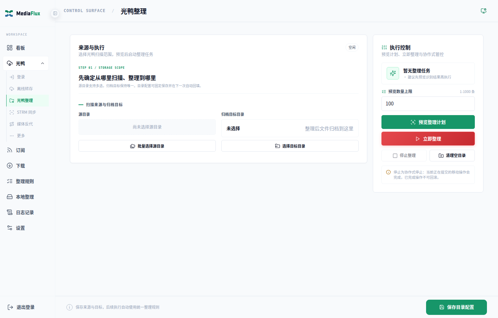

## 5. 本地媒体整理

进入 `/local-media`：

1. 新增来源，选择待整理根目录。
2. 配置电影、剧集、动漫目标目录及可选 qB 路径映射。
3. 手动整理时先“检查目录”，再搜索/自动匹配并查看无副作用计划。
4. 确认后执行安全移动；跨文件系统会先复制到目标临时文件、校验，再删除源文件。
5. 定时整理与手动整理共用统一规则和日志。

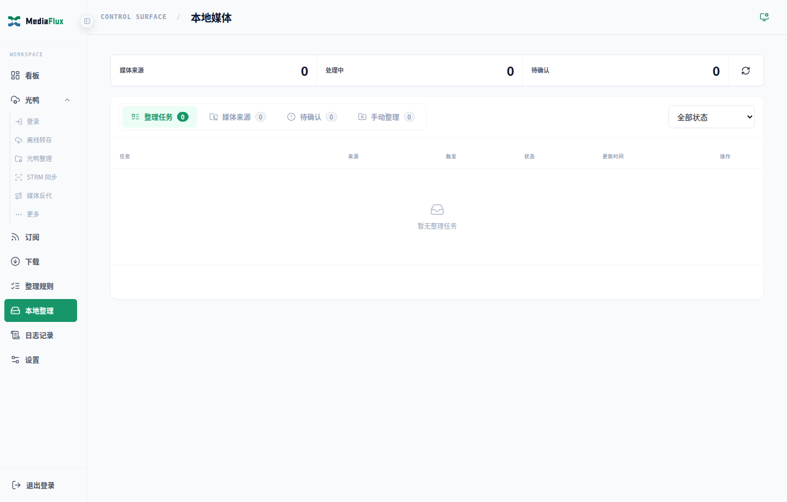
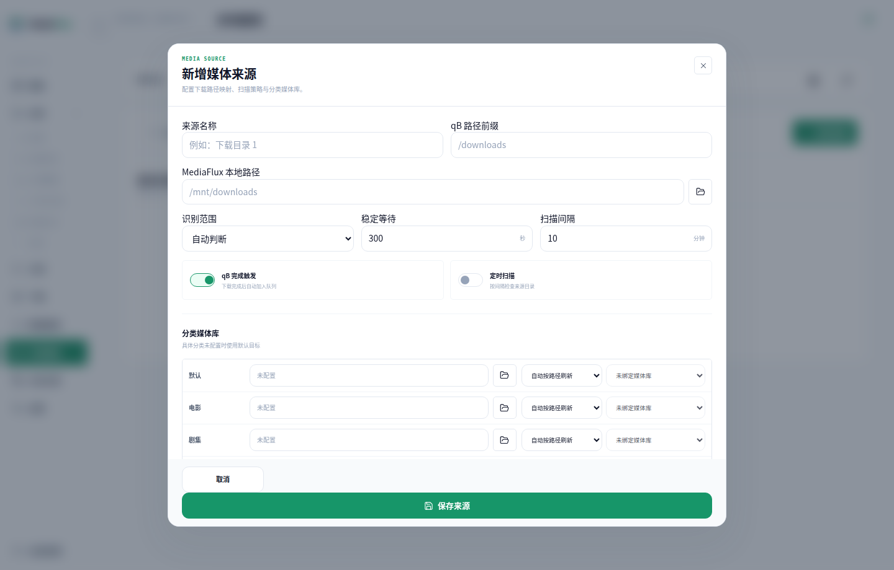

## 6. STRM 同步与播放

在“光鸭 → STRM 同步”配置：

- 多个光鸭来源目录。
- `STRM_ROOT`：MediaFlux 本地 `.strm` 输出目录。
- `GY_STRM_BASE_URL`：Jellyfin/Emby 和播放器可访问的 MediaFlux 地址。
- 定时同步、元数据、通知和媒体库刷新。

整理联动与页面“快速同步”只处理持久化变化队列；手动“完整校准”、`/sync_gy` 和 Cron 定时任务使用 15 个目录扫描线程遍历配置来源。远端外部删除、改名、etag/大小变化会在完整校准时通过持久化索引更新或清理本地镜像。

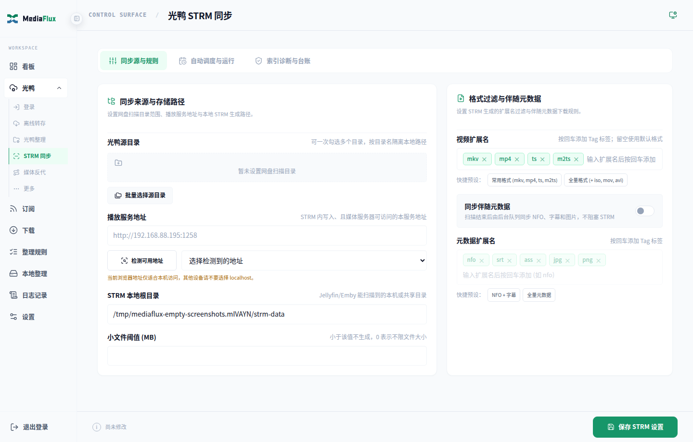

## 7. RSS 与下载

- `/rss` 添加 Mikan 等订阅、刷新条目并提交单个或批量下载。
- `/downloads` 查看 qB/光鸭进度、失败、待处理和历史。
- 批量操作支持启动、停止和删除。
- 待处理项可重新投递到光鸭、qB 或两者，也可清除本条待处理状态。

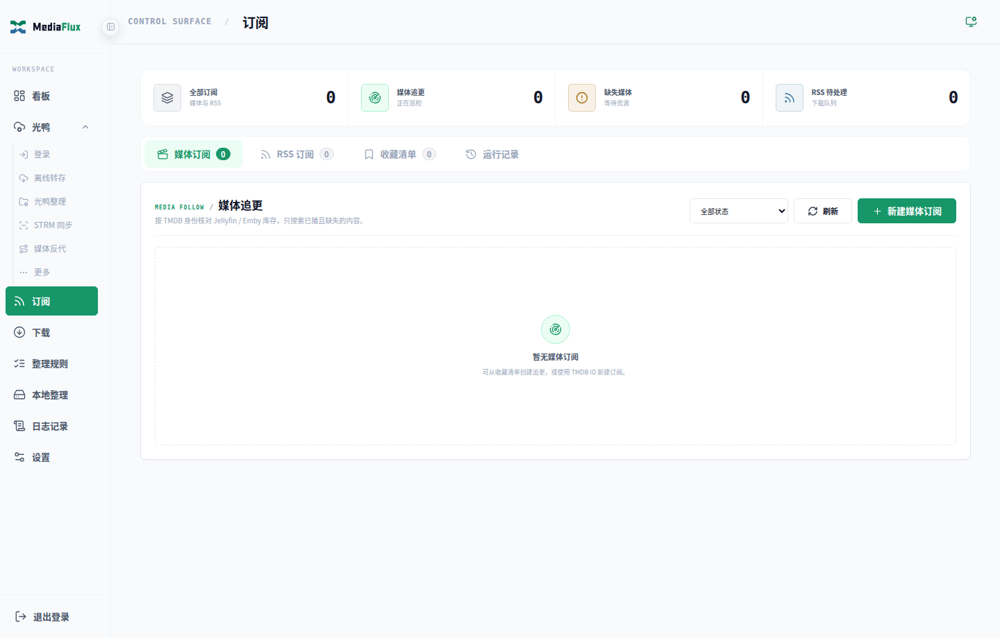
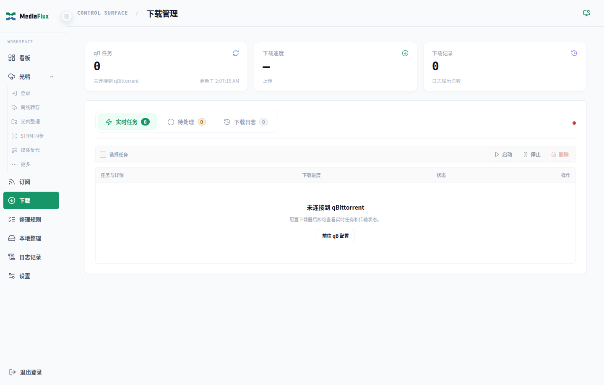

## 8. Telegram Bot

常用命令：

| 命令 | 功能 |
| --- | --- |
| `/start` | 查看帮助 |
| `/sync_gy` | 并发扫描全部来源并完整校准 STRM |
| `/organize_gy` | 提交光鸭整理任务 |
| `/media_search 片名` | 搜索媒体资源 |
| `/媒体搜索 片名` | 中文别名 |
| `/rss` | 查看订阅 |
| `/rss_refresh ID` | 刷新订阅 |
| `/rss_dl ID` | 下载条目 |
| `/status` | 查看系统状态 |
| `/agent` | 始终可用；查看状态并开启/关闭 Telegram Agent 或全部 Media Agent |
| `/agent_reset` | Agent 已启用时重置当前会话与待确认操作 |

`/sync_gy` 完成后会按云盘来源分别发送目录 ID、本地同步目录、扫描文件、STRM 新建/更新、清理内容和阶段耗时，最后再发送一条全部来源汇总。

确认执行 STRM、网盘整理、RSS 刷新或下载操作后，原确认卡会立即移除按钮并在任务接纳后自动清理；即使 Telegram 无法删除旧消息，也会保留明确的“已确认/未启动/已失效”状态，避免再次进入 Bot 时误以为任务尚未提交。

直接发送磁力、ED2K、HTTP(S) 或 `.torrent`，Bot 会询问投递到 qB、光鸭或两者。异常资源会返回明确原因，不静默丢弃。

人工确认会以候选按钮进入队列；点击后只提交选择，不要求等待上一个目录完成。剧集通知按媒体/季汇总，并显示本次集数、全季进度和缺集信息。

## 9. 媒体探索与资源搜索

启用“设置 → 媒体探索”后，可浏览媒体档案和多站资源。站点标签可筛选右侧结果；失败站点会显示具体原因。资源默认按发布时间从新到旧，可批量推送到 qB、光鸭或两者。

最近入库与全局搜索不占用侧栏入口，通过看板顶栏访问：

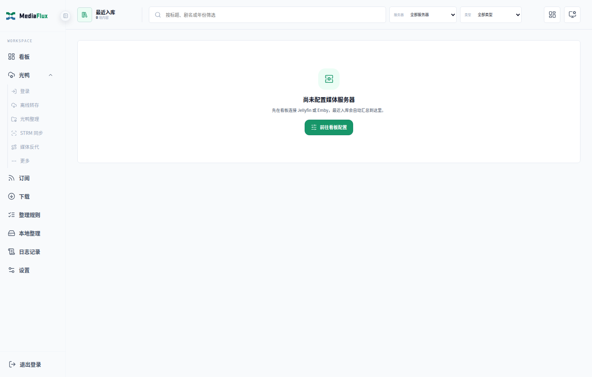

## 10. 日志、刮削实验室与纠偏

`/logs` 包含：

- 整理日志：光鸭和本地来源标志、状态筛选、详情、重新识别、回退和移入回收站。
- 实时日志：应用运行日志与规范化异常。
- 刮削实验室：输入文件名和父目录，查看解析、候选、评分和命名预览。

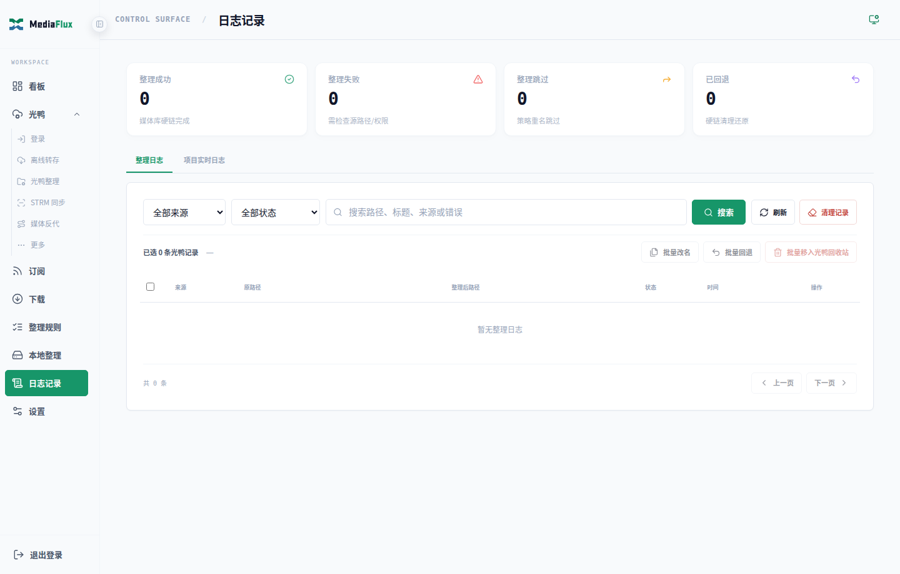
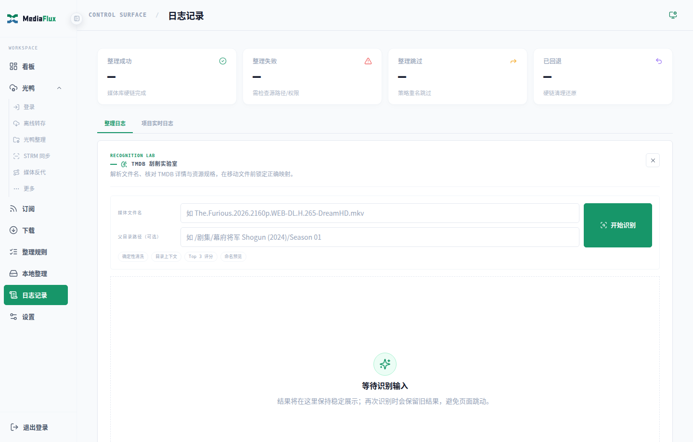

固定命名资源可在“设置 → 刮削识别”管理 TMDB 映射锁；`/tools` 仅保留迁移后的功能导航。

## 11. Media Agent

Agent 默认受总开关控制。启用模型后，可使用自然语言查询系统状态、媒体、订阅、任务、日志和配置说明。

- 明确命令优先走本地确定性工具。
- 模型路由支持自动识别 Responses API/Chat Completions，并可从 Base URL 获取模型列表。
- 写操作必须二次确认。
- 关闭总开关后 Web/Telegram Agent 和后台巡检均停止，配置与历史保留。

## 12. 移动端

主要页面支持移动端导航与表单布局。复杂整理和大量候选预览仍建议使用桌面端。

| 看板 | 整理 | RSS |
| --- | --- | --- |
|  | 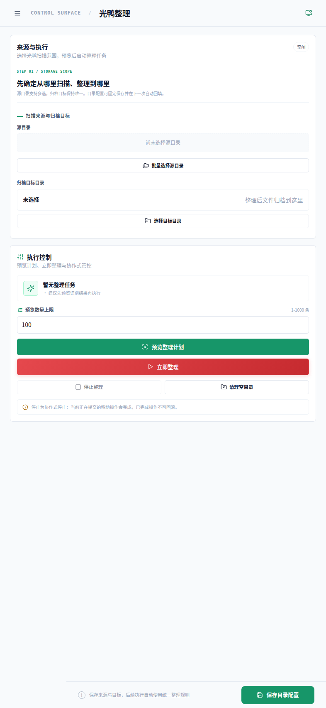 |  |
