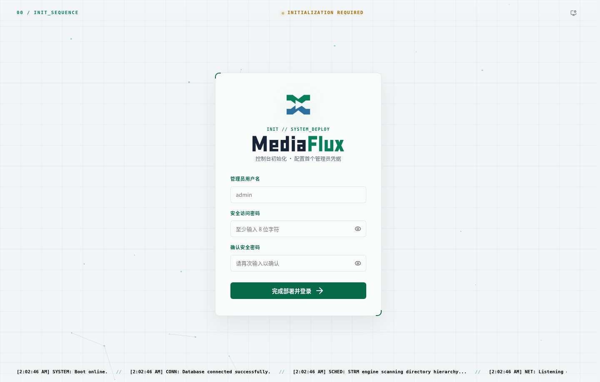
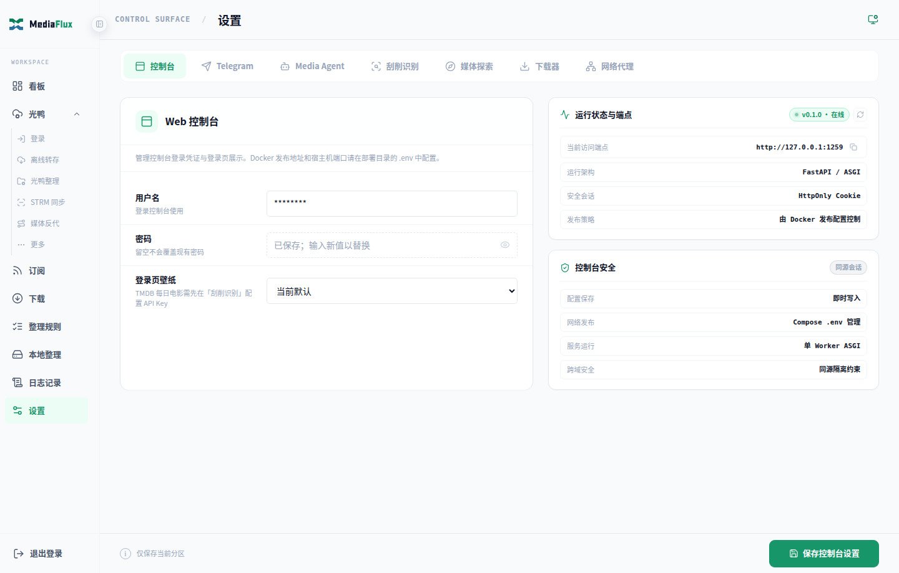
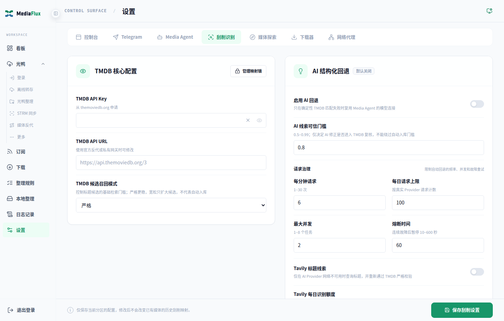
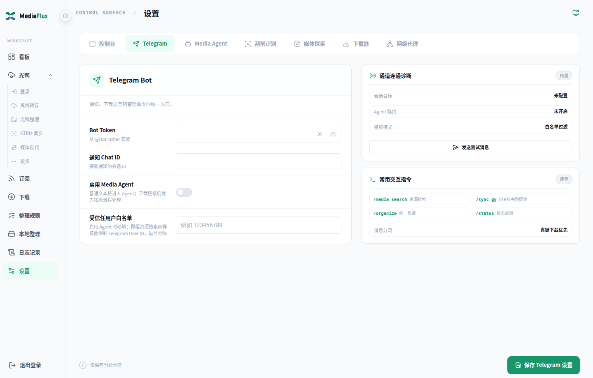
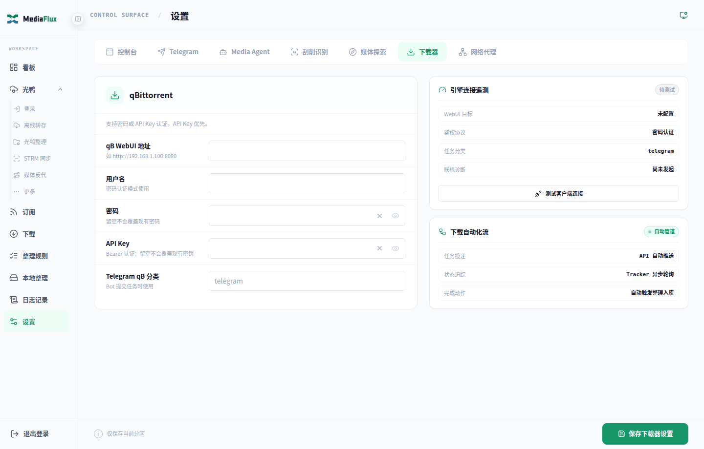
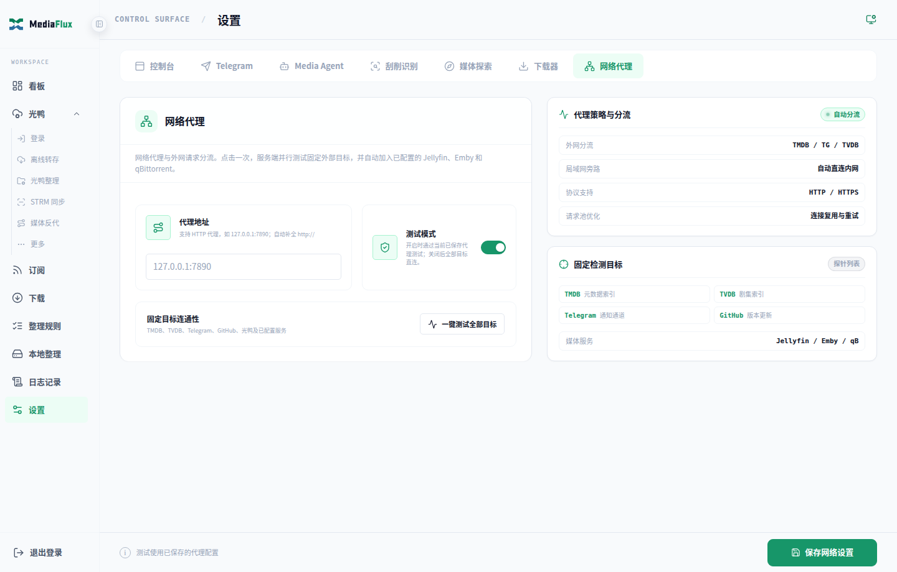
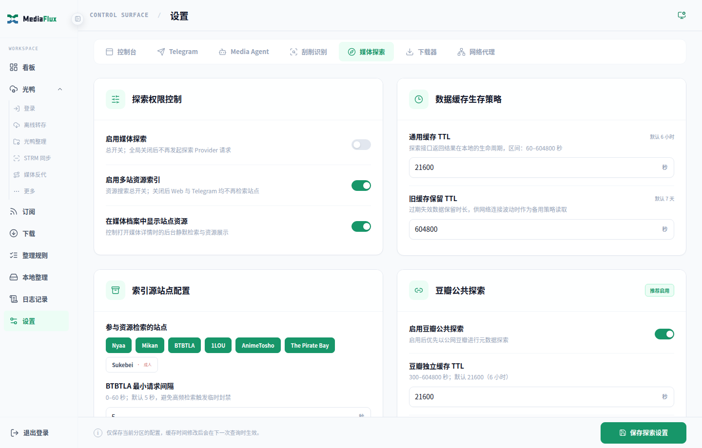
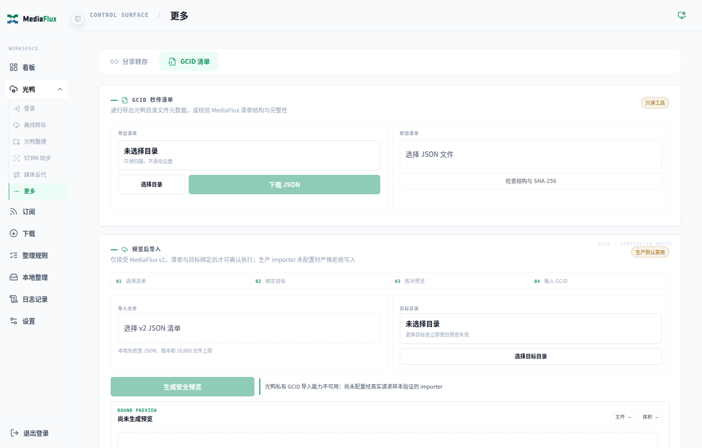
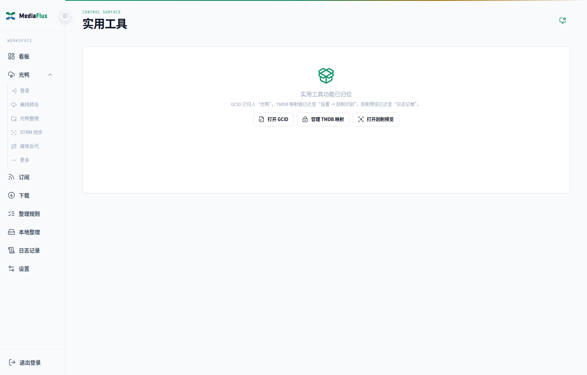

# MediaFlux 配置教程

> 更新日期：2026-08-20

## 目录

- [1. 初始化与登录](#1-初始化与登录)
- [2. 配置媒体服务器](#2-配置媒体服务器)
- [3. TMDB、识别与 AI 回退](#3-tmdb识别与-ai-回退)
- [4. Telegram Bot](#4-telegram-bot)
- [5. qBittorrent](#5-qbittorrent)
- [6. 网络代理](#6-网络代理)
- [7. 光鸭登录与离线任务](#7-光鸭登录与离线任务)
- [8. 统一整理规则](#8-统一整理规则)
- [9. 光鸭整理](#9-光鸭整理)
- [10. 本地媒体](#10-本地媒体)
- [11. STRM](#11-strm)
- [12. RSS、下载与分享](#12-rss下载与分享)
- [13. 探索、搜索与 Agent](#13-探索搜索与-agent)
- [14. 日志与纠偏](#14-日志与纠偏)
- [15. 其他光鸭工具](#15-其他光鸭工具)
- [16. 移动端](#16-移动端)

## 1. 初始化与登录

首次访问 `/setup` 创建管理员账号。之后通过 `/login` 登录。



## 2. 配置媒体服务器

进入“设置 → 控制台”：

1. 选择 Jellyfin 或 Emby。
2. 填写服务地址，例如 `http://192.168.1.10:8096`。
3. 填写 API Key。
4. 测试连接并保存。

保存后的 Secret 不会回传完整明文；眼睛按钮只能显示本次输入的值，这是安全设计。



配置成功后看板显示真实媒体概览、最近播放和最近入库；未配置时显示无数据空状态。


## 3. TMDB、识别与 AI 回退

进入“设置 → 刮削识别”：

- 填写 TMDB API Key 与可选 API URL。
- 选择严格匹配和刮削前确认策略。
- 可选开启 AI 结构化回退。
- 使用“管理映射锁”维护固定命名资源。



AI Base URL 建议填写到 `/v1`，例如 `https://api.example.com/v1`。协议选择“自动”时会尝试 Responses API 或 Chat Completions；模型可从 Provider 的 `/models` 获取。

## 4. Telegram Bot

进入“设置 → Telegram”：

1. 从 BotFather 创建 Bot 并填写 Token。
2. 填写允许操作的 Chat ID。
3. 群组或 Agent 场景填写允许用户 ID。
4. 保存后执行测试通知。



网络受限时，在“网络代理”配置 HTTP 代理并测试 Telegram。

## 5. qBittorrent

进入“设置 → 下载器”：

- qB Web UI 地址。
- 用户名、密码。
- 默认分类、保存路径。
- 本地整理使用的 qB 路径映射。



Docker 中 qB 与 MediaFlux 的容器路径可不同，但必须指向同一宿主机目录。详见[部署指南·附录 B](部署指南.md)。

## 6. 网络代理

进入“设置 → 网络代理”：

- 代理地址可填写 `127.0.0.1:7890`，系统会补全协议。
- 测试模式开启后，固定目标通过代理检查。
- 可分别查看 TMDB、TVDB、Telegram、GitHub、光鸭等结果。



## 7. 光鸭登录与离线任务

进入“光鸭 → 登录”，完成短信验证。Token 支持刷新、校验和清除。


“离线转存”配置允许扩展名和排除词。允许扩展名为空时使用内置媒体默认值；Web 输入框会展示当前有效默认项。


## 8. 统一整理规则

进入 `/organize-rules`：

1. 确认视频扩展名和伴随文件扩展名标签。
2. 配置电影、剧集、动漫等分类目录。
3. 选择冲突、多版本和回收站策略。
4. 配置空目录清理、STRM 联动、Telegram 通知和媒体库刷新。
5. 按需增加 TMDB 强制匹配规则。


这些规则同时作用于光鸭、本地、Web、Telegram 与定时任务。命名与媒体规格补全采用固定契约，不再提供模板或开关：电影始终建立独立 `{tmdb-ID}` 目录，剧集始终建立 `Season N（如 `Season 1`，季号不补零）` 目录；本地文件直接使用 ffprobe，光鸭文件通过 signedURL/直链探测并缓存成功结果。探测失败不会阻断整理。

## 9. 光鸭整理

进入 `/organize`：

- 可选择多个来源目录。
- 配置统一归档目标。
- 先生成无副作用预览，再立即整理。
- 自动任务按目录排队；需确认项目通过 Telegram 或日志详情处理。


## 10. 本地媒体

部署时先挂载来源和目标目录，再进入 `/local-media` 新增来源：

- 来源根目录。
- 电影、剧集、动漫目标目录。
- 可选 qB 路径前缀。
- 定时任务和媒体库刷新。


手动整理流程是“检查目录 → 识别媒体 → 预览目标 → 确认移动”。

## 11. STRM

进入“光鸭 → STRM 同步”：

- 选择一个或多个光鸭来源。
- `STRM_ROOT` 填 MediaFlux 可写目录。
- `GY_STRM_BASE_URL` 填媒体服务器与播放器可达的 MediaFlux 地址。
- 配置定时同步、通知和媒体库刷新。


Jellyfin/Emby 需要挂载同一 STRM 目录并添加媒体库。播放链路为：

```text
播放器 -> Jellyfin/Emby 读取 .strm -> MediaFlux /playgy -> 光鸭 signedURL -> 302 直连
```

## 12. RSS、下载与分享


RSS 条目可批量推送到 qB/光鸭；下载页分别记录每个目标的提交和完成状态。待处理页提供重试与清除异常状态。

## 13. 探索、搜索与 Agent

“设置 → 媒体探索”启用 Provider 和多站资源索引：



全局搜索和最近入库通过看板顶栏进入：


Agent 在“设置 → Media Agent”配置。关闭总开关会隐藏 Agent 页面并停止 Agent API、Telegram Agent 和后台巡检。

## 14. 日志与纠偏


整理日志同时显示光鸭和本地来源。详情中可查看跳过原因、重新搜索 TMDB、预览目标、重新整理、回退或移入回收站。

## 15. 其他光鸭工具

- GCID 清单：
- `/tools`：旧工具迁移后的导航页。

## 16. 移动端

| 看板 | 整理 | RSS |
| --- | --- | --- |
|  |  |  |
